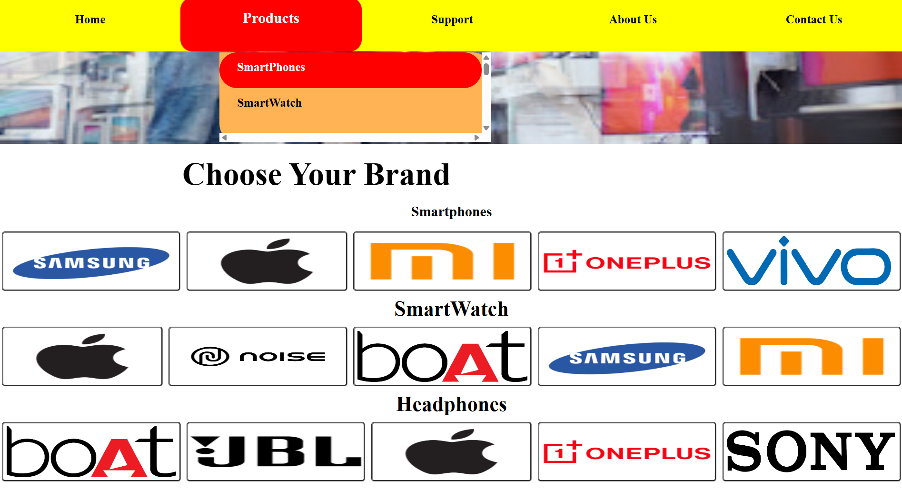

# 🚀 Electron Hub

A **modern electronics showcase website** displaying top technology brands and products with a clean UI, built using **HTML, CSS, and JavaScript**.

---

## 🌐 Live Demo

Explore the live website on Netlify:

---

## 🖥 Project Overview

**Electron Hub** is a fully responsive and user-friendly front-end website designed to showcase popular electronic brands and product categories.

### ✨ Key Features

- Clean & modern **navigation bar**
- **Dropdown product menu** (Smartphones, Smartwatches, Headphones)
- Brand-based product display
- Attractive **hero banner**
- Fully **responsive design** (Desktop & Mobile)
- Beginner-friendly UI and code structure

---

## 👀 Project Overview

## 🛠 Technologies Used

  
  
  

- **HTML5** – Page structure & semantic layout  
- **CSS3** – Styling, layout & responsiveness  
- **JavaScript** – Menu interactions & UI behavior  
- **Netlify** – Live deployment  

---
